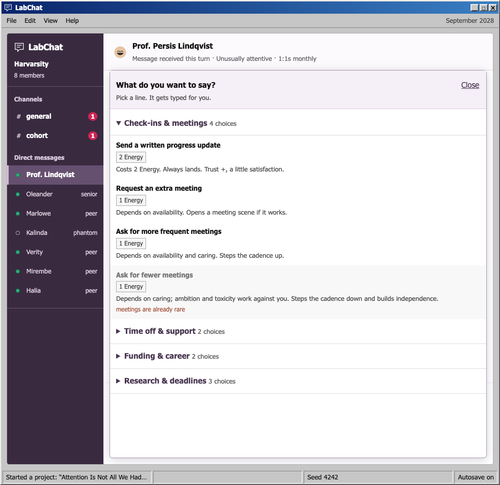
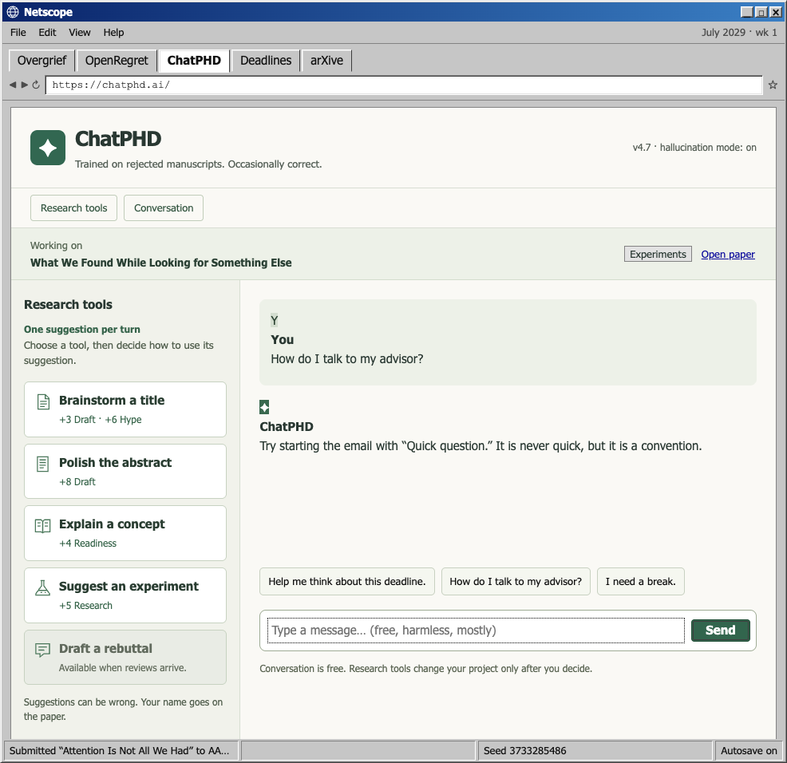
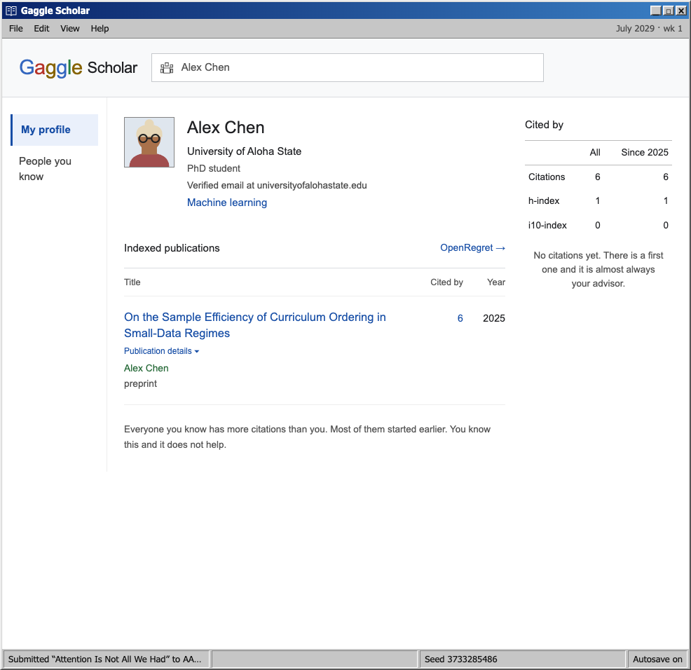

<div align="center">

# Academic OS

### A satirical simulator of a US computer-science PhD, as a desktop from 1998.

**[▶ Play it in your browser](https://rexzchen.github.io/PhD-Simulator/)** · no install · no account · nothing leaves your machine


*Screenshots from the browser release, v1.12.0.*

</div>

---

<table>
<tr><td width="50%" valign="top">

### Six years. One decision at a time.

You apply, you pick an advisor with incomplete information, you run projects, you publish or you don't, you sit three exams, and you find out what you become.

Then it keeps going, because a PhD does not end at graduation and neither does your advisor.

</td><td width="50%" valign="top">

|  |  |
|---|---|
| **360** written scenes | **118** achievements |
| **32** programs | **12** career endings |
| **2** languages | **0** microtransactions |

</td></tr>
</table>

---

<div align="center">

### The decision arrives the way it actually arrives


*The email says there is an update. It does not say what it is. The answer is behind a login.*

</div>

---

<div align="center">

### Room 214 is an hour, not a dice roll


*Forty minutes of talking while four people decide what to ask you. Then fifteen minutes of being asked it. Then five minutes in a corridor with one chair while they decide, out loud, without you.*

</div>

---

<details>
<summary><b>Inside the workspace — LabChat, ChatPHD, and Gaggle Scholar</b></summary>

<br>

**LabChat** — Lab channels, direct messages, and the careful wording of a message to your advisor.



**ChatPHD** — Research tools beside a conversation that is occasionally helpful.



**Gaggle Scholar** — Your publications, citation counts, and an invitation to compare yourself with everyone else.



</details>

---

## What it is actually about

> “Four minutes at a whiteboard and the problem is a different, smaller problem. You have been carrying it for three weeks and they put it down in four minutes and you are not sure how to feel about that.”

> “*No action is required on your part*” is the cruellest sentence in academic correspondence, because it is true and because it means you will spend six weeks doing nothing about something.

Miserable and enjoyable at once. A PhD is genuinely hard, you go through a lot, and over a long enough horizon it is worth it — you start as a first-year who knows nothing and end, if you get there, as someone who knows what they are doing.

<details>
<summary><b>Some of what is in there</b></summary>

<br>

| | |
|---|---|
| **The application** | A statement nobody reads twice, letters you have to ask for, and thirty-two programs whose odds you can finally see. A cycle that produces nothing costs you a year, not the save file. |
| **The advisor** | Traits you cannot see from a website. Ask their students; the answers are biased, tired, or both. |
| **Being stuck** | Six doors — advisor, labmate, collaborator, search, ChatPHD, go home. None is strictly best. The game never tells you which. |
| **Publishing** | Real conference cycles, rebuttals, Reviewer 2, arXiv timestamps, and Anywhere on Earth. |
| **The visa** | A second game running underneath the first one, for the players who need it. |
| **Money** | A stipend, a city, a reimbursement that takes four months, and a summer nobody funded. |
| **The body** | It sends letters. The deadline does not move, and that is the part nobody warns you about. |
| **The desk** | A plant that is not real. A chair somebody keeps lowering. A yogurt in the fridge with a name on it. |

</details>

## Run it locally

```bash
npm install
npm run dev
```

| | |
|---|---|
| `npm test` | engine, save and activity tests |
| `npm run test:e2e` | browser gameplay and usability checks |
| `npm run i18n` | plays real runs in Chinese; must print zero |
| `npm run balance` | 40 seeds × 3 playstyles |
| `npm run reach` | which written content anybody actually reaches |

Vanilla ES modules and Vite. No framework or backend. Data in `src/data/`, rules in `src/engine/`, rendering in `src/ui/`.


**[Contributing →](CONTRIBUTING.md)** · [Report a bug](https://github.com/RexZChen/PhD-Simulator/issues/new?template=bug.yml) · [Suggest a scene](https://github.com/RexZChen/PhD-Simulator/issues/new?template=content.yml) · [Argue with a number](https://github.com/RexZChen/PhD-Simulator/issues/new?template=balance.yml)

## Disclaimer

**This is a vibe-coded side project, made for fun. It is not an attack on anyone.**

Everything in it is invented. Every school, advisor, labmate, committee member, company, employer,
lab and venue is fictional or a parody placeholder; names are generated at random from made-up
lists. Any resemblance to real people, institutions or venues — living, dead or tenured — is
coincidental and unintended. Nothing here is affiliated with, endorsed by, or advice about any real
program, employer or person.

Salaries, fees, visa outcomes, medical bills and acceptance rates are made up for comic effect and
are **not advice** — not financial, medical, immigration, career or academic advice. Venue timing is
modelled on representative published 2025–2027 cycles and projected forward into fictional years; it
is not a live deadline calendar. Real city names and their landmarks appear affectionately as travel
settings, and nothing said about them is a claim about any real business or organisation.

The satire is pointed at *systems and situations* — funding gaps, review lotteries, immigration
paperwork, the job market — and not at individuals. If any of it lands close to home, that is
because these situations are widely shared, not because anyone in particular was in mind.
